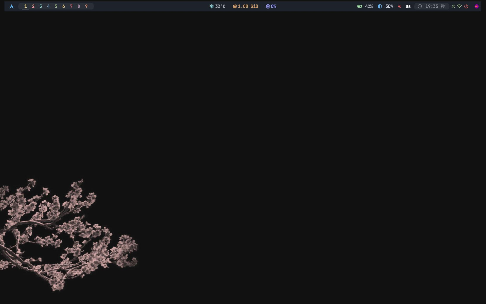

# BSPWM Dotfiles




Мои персональные dotfiles для минималистичного и продуктивного окружения на базе **BSPWM** в Arch Linux. Репозиторий включает конфигурации для BSPWM, SXHKD, Polybar, Picom, Rofi, Dunst и Fish shell, а также скрипт для автоматической установки всех моих программ и настроек.

## Особенности

- **Минималистичный BSPWM**: Лёгкий оконный менеджер с настраиваемыми отступами и правилами окон.
- **Горячие клавиши**: SXHKD с удобными комбинациями (например, `Super + Enter` для терминала, `Super + D` для Rofi).
- **Polybar**: Настраиваемая панель с модулями для CPU, RAM, батареи и сети.
- **Picom**: Прозрачность и анимации для окон.
- **Rofi**: Быстрый лаунчер приложений с кастомным дизайном.
- **Dunst**: Стильные и ненавязчивые уведомления.
- **Fish Shell**: Интерактивная оболочка с автодополнением и скриптами.
- **Автоматизация**: Скрипт `install.sh` устанавливает все пакеты из `packages.txt` и копирует конфигурации.

## Требования

- **Операционная система**: Arch Linux (основная поддержка) или Ubuntu/Debian (частичная, см. `Docs/installation.md`).
- **Разрешение экрана**: Оптимизировано для 1920x1080 (настройте под своё разрешение).
- **Зависимости**: Полный список программ в `packages.txt` (включает `bspwm`, `sxhkd`, `polybar`, `picom`, `rofi`, `dunst`, `fish`, `alacritty`, шрифты Nerd Fonts и др.).
- **Интернет**: Для загрузки пакетов и клонирования репозитория.

## Установка

### Шаг 1: Клонирование репозитория
```bash
git clone https://github.com/PDTPLR/Linux.git
cd Linux
```

### Шаг 2: Запуск скрипта установки
Скрипт `install.sh` устанавливает все пакеты из `packages.txt`, копирует конфигурации и настраивает `.xinitrc`. Для Arch Linux он устанавливает все ваши программы, для Ubuntu/Debian — только совместимые.

```bash
chmod +x scripts/install.sh
./scripts/install.sh
```

> **Примечание**: Скрипт создаёт резервную копию существующих конфигураций в `~/.config/backup-ДД-ММ-ГГГГ-ЧЧММСС`. Для Ubuntu/Debian некоторые пакеты (например, `yay`, `*-nerd`) могут отсутствовать, проверьте `Docs/installation.md`.

### Шаг 3: Запуск BSPWM
```bash
startx
```

Подробности в [Docs/installation.md](Docs/installation.md).

## Конфигурация

- **BSPWM**: `~/.config/bspwm/bspwmrc` — настройки отступов, границ и правил окон.
- **SXHKD**: `~/.config/sxhkd/sxhkdrc` — горячие клавиши (например, `Super + Enter` для Alacritty).
- **Polybar**: `~/.config/polybar/config.ini` — панель с модулями CPU, RAM, батареи и яркости.
- **Picom**: `~/.config/picom/picom.conf` — анимации и прозрачность окон.
- **Rofi**: `~/.config/rofi/config.rasi` — меню приложений и скриптов.
- **Dunst**: `~/.config/dunst/dunstrc` — настройки уведомлений.
- **Fish Shell**: `~/.config/fish/config.fish` — алиасы, функции и настройки для Fish.
- **Обои**: Устанавливаются через `feh` в `bspwmrc` (например, `feh --bg-fill /path/to/wallpaper.jpg`).

## Скриншоты

- Основной десктоп: 
- Меню Rofi: 

## Устранение неполадок

- **Polybar не показывает батарею**:
  - Проверьте имя батареи:
    ```bash
    ls /sys/class/power_supply/
    ```
  - Обновите `~/.config/polybar/config.ini`, заменив `BAT0` на ваше имя батареи.
  - Перезапустите Polybar:
    ```bash
    polybar-msg cmd restart
    ```

- **Анимации тормозят**:
  - Закомментируйте `picom &` в `~/.config/bspwm/bspwmrc`:
    ```bash
    # picom &
    ```
  - Или настройте `~/.config/picom/picom.conf` для меньшей нагрузки.

- **Проблемы с драйверами**:
  - Убедитесь, что установлены драйверы видеокарты:
    ```bash
    sudo pacman -S xf86-video-intel  # для Intel
    sudo pacman -S nvidia nvidia-utils  # для NVIDIA
    sudo pacman -S mesa  # для AMD
    ```

Подробности в [Docs/troubleshooting.md](Docs/troubleshooting.md).

## Документация

- [Установка](Docs/installation.md) — пошаговые инструкции для Arch и Ubuntu.
- [Устранение неполадок](Docs/troubleshooting.md) — решения распространённых проблем.

## Вклад

1. Форкните репозиторий: `https://github.com/PDTPLR/Linux`.
2. Внесите изменения в своей ветке.
3. Создайте Pull Request с описанием изменений.
4. Вопросы и предложения? Пишите в [Issues](https://github.com/PDTPLR/Linux/issues).


## Лицензия

MIT License — см. [LICENSE](LICENSE).
```
