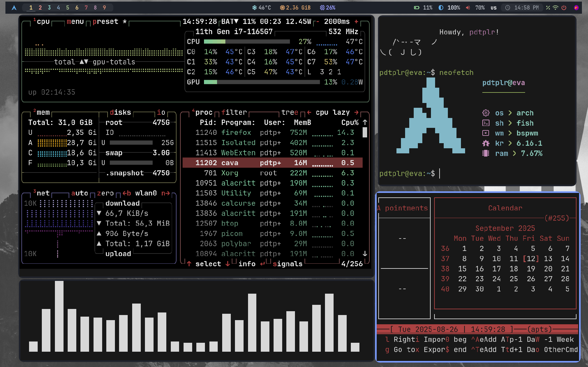
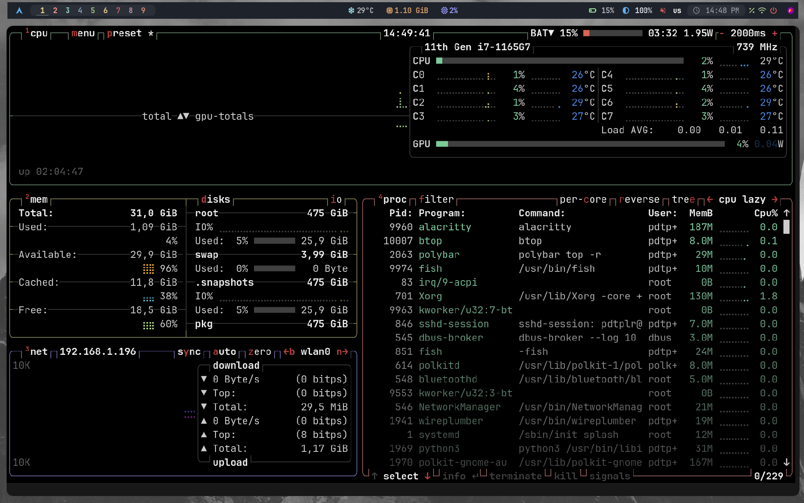
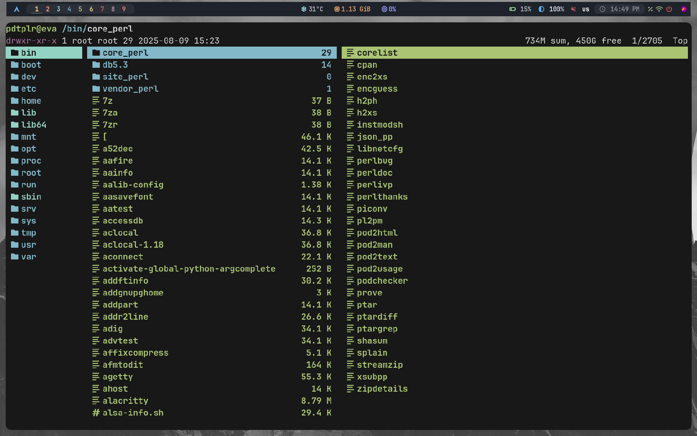

# 🌌 Dotfiles для BSPWM от PDTPLR 🌌

  


Добро пожаловать в мои dotfiles! Это минималистичная настройка BSPWM для Arch Linux с поддержкой Ubuntu/Debian, созданная для простоты, производительности и эстетики. Подходит для всех, кто хочет стильный и функциональный рабочий стол! 🌈


## 📖 О проекте

Лёгкое и настраиваемое окружение для работы, творчества и повседневных задач.

- **ОС**: Arch Linux (основная), Ubuntu/Debian (частичная поддержка)
- **Оконный менеджер**: BSPWM
- **Панель**: Polybar
- **Композитор**: Picom
- **Терминал**: Alacritty
- **Лаунчер**: Rofi
- **Уведомления**: Dunst
- **Оболочка**: Fish


## 🖼 Галерея

|  |  |  |


## ✨ Возможности

- **Гибкость**: Конфигурации для BSPWM, Polybar, Rofi и других инструментов легко адаптируются под ваши нужды (configs/).
- **Обои**: 63 изображения для динамической смены фона (assets/wallpapers/).
- **Шрифты**: Nerd Fonts для стильных иконок и терминалов (assets/fonts/).
- **Скрипты**: Утилиты для управления системой, обоями, Wi-Fi и цветами (scripts/utils/, scripts/color-scripts/, scripts/fetchs/).
- **Горячие клавиши**: Настроены для удобства и скорости (configs/sxhkd/sxhkdrc).
- **Лёгкость**: Потребление памяти менее 700 МБ.
- **Автоматизация**: Установка через install.sh или интерактивный install.py с выбором компонентов.
- **Документация**: Подробные инструкции для всех пользователей (docs/installation.md, docs/troubleshooting.md, scripts/docs/).


## 🌍 Доступность для всех

Мы хотим, чтобы проект был удобен каждому:

- Поддержка разных разрешений экрана (не только 1920x1080).
- Инструкции для Arch Linux и Ubuntu/Debian (docs/installation.md).
- Документация на русском языке для новичков и опытных пользователей.
- Обратная связь через [Issues](https://github.com/PDTPLR/Linux/issues) для любых вопросов или предложений.


## ⚠ Важно

Конфигурация оптимизирована для Arch Linux и экранов 1920x1080, но работает на других разрешениях и дистрибутивах с небольшими настройками. Если что-то не работает, смотрите docs/troubleshooting.md или пишите в [Issues](https://github.com/PDTPLR/Linux/issues).


## 📦 Установка

### 🚀 Быстрая установка (install.sh)

1. Клонируйте репозиторий:
    
    ```bash
    git clone https://github.com/PDTPLR/Linux.git
    cd Linux
    ```
    
2. Запустите скрипт:
    
    ```bash
    chmod +x scripts/install.sh
    ./scripts/install.sh
    ```
    
    > Устанавливает пакеты, копирует конфигурации, скрипты, обои, шрифты, настраивает `.xinitrc` и `PATH`.
    
3. Запустите BSPWM:
    
    ```bash
    startx
    ```
    

### 🛠 Интерактивная установка (install.py)

1. Клонируйте репозиторий (см. выше).
2. Запустите скрипт с меню:
    
    ```bash
    chmod +x scripts/install.py
    ./scripts/install.py
    ```
    
    > Выберите компоненты: пакеты, конфигурации, скрипты, обои, шрифты, `.xinitrc`, `PATH`.
    
3. Запустите BSPWM:
    
    ```bash
    startx
    ```
    

Подробные инструкции: docs/installation.md.


## 🛠 После установки

Если возникли проблемы, смотрите docs/troubleshooting.md. Основные случаи:

- **Батарея не отображается в Polybar**: Проверьте имя батареи (`ls /sys/class/power_supply/`) и обновите scripts/utils/battery-alert и configs/polybar/config.ini.
- **Анимации тормозят**: Закомментируйте `picom &` в configs/bspwm/bspwmrc или настройте configs/picom/picom.conf.
- **Обои не меняются**: Убедитесь, что `feh` установлен и обои в `~/Images` (проверьте scripts/utils/random_wallpaper).
- **Шрифты некорректны**: Проверьте `~/.local/share/fonts/` и выполните `fc-cache -fv`.


## 🎹 Горячие клавиши

- **Открыть терминал**: `Super + Enter`
- **Случайные обои**: `Super + W`
- **Смена раскладки**: `Shift + Alt`
- **Меню приложений (Rofi)**: `Super + D`
- **Блокировка экрана**: `Super + Shift + L`
- **Выбор цвета на экране**: `Super + Shift + X`
- **Переключение Polybar**: `Super + Shift + P`
- **Плавающий режим окна**: `Super + Space`
- **Закрыть окно**: `Super + C`
- **Переключение рабочих столов**: `Super + 1-9`
- **Переместить окно на стол**: `Super + Shift + 1-9`
- **Перезапуск BSPWM**: `Ctrl + Shift + R`
- **Снимок экрана**: `Print`

Полный список: configs/sxhkd/sxhkdrc. Используйте scripts/utils/show-keybindings.sh для просмотра.


## 🤝 Как помочь проекту

1. Сделайте форк: [PDTPLR/Linux](https://github.com/PDTPLR/Linux).
2. Создайте ветку: `git checkout -b feature/ваша-идея`.
3. Внесите изменения: `git commit -m "Добавлена идея"`.
4. Запушьте: `git push origin feature/ваша-идея`.
5. Откройте Pull Request: [Pull Requests](https://github.com/PDTPLR/Linux/pulls).

Сообщайте об ошибках или идеях в [Issues](https://github.com/PDTPLR/Linux/issues).


